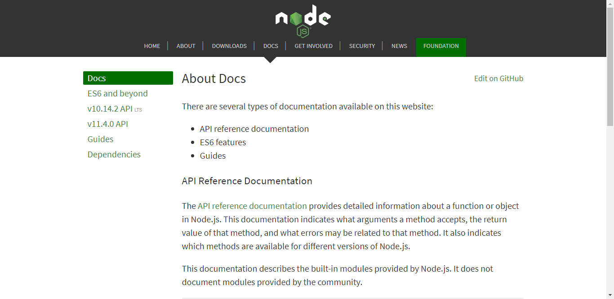

# Webduino-Basic

## 前言

本文初步介绍 Webduino 整体架构设计，给大家有一个基本的认识，包括它是如何快速简易的架设物联网的，注意，本文不适合没有任何编程基础的人尝试，如果没有任何编程基础，可以右转[BPI-BIT-MicroPython](https://github.com/BPI-STEAM/BPI-BIT-MicroPython/wiki)，因此这需要具备天赋技能，会玩会折腾，以及前置语言技能：JavaScript，再加上基本搜索技能，会百度会谷歌会提问会交流，确定你具备了这些技能，就来走入未来的 物联网 与 云服务 结合的 Webduino 世界吧。

## 认识 webduino 基本架构

- 

有关技术关键词

- 协议层 **Firmata**

- 传输层 **Serial**、**Bluetooth**、**WebSocket**、**MQTT**

- 语言层 **JavaScript**、**MicroPython**

- 控制层 **HTML**、**Browser**、**Nodejs**、**Blockly**、**WebCompent**

物联网基础媒介

- 硬件之中的固件程序（Webduino.bin）

- 这是一段通用程序内置在底层芯片中，并将常用的硬件接口抽象映射成 **Firmata** 控制协议。

- 能够通过一个标准的串行协议来实现与计算机应用程序的通信。适用于所有 **Arduino** 板。

- 

- 基于 **WebKit** 的容器（Google Chrome）

- **WebKit** 是一个开源的浏览器引擎，与之相对应的引擎有Gecko（Mozilla Firefox 等使用）和Trident（也称MSHTML，IE 使用），广义上认为是 Google Chrome/Chromium 浏览器的核心渲染引擎，如下图可以在 手机、电脑、笔记本上见到它，也就是基于谷歌内核的浏览器。

- 

### 提供三个物联网典型模型

以下提出三种可以适用所有场合的物联网基础场景。

#### 点对点连接设备

- 

一台物联网设备通过 USB 或 蓝牙 来建立连接，然后再通过 WebKit 的容器控制。

#### 点对多连接设备

- 

多个物联网设备借助一台路由设备（或笔记本），通过 Websocket 来与上层服务建立连接来控制设备，控制的设备可以是路由器自身，也可以是电脑，只要是能运行 WebKit 的容器都可以作为控制器来控制众多设备，形成物联网基本内网。

#### 多对多连接设备

- 

将物联网设备接入网络，然后通过外界的 MQTT 服务器 中转 数据到另一端控制器上，这样就可以完成多对多的网络环境，从而与先前一样，通过 WebKit 的容器来控制设备。

### 名词简答

Q：提到的 WebKit 的容器是指什么？

A：我们可以认为 但凡支持 JavaScript 以及 Websocket 等功能的现代浏览器， 都是我们需要的  WebKit 的容器。

Q：MicroPython 在这里有什么用呢？

A：因为 MicroPython 在我看来可以作为底层的动态 Code 修改的固件基础，不需要额外的 OTA 也可以做到需要的升级程序，并且也有足够多的 Python 库作为底层核心的支撑。（最重要的是，我要是做 MicroPython 的底层支持，写起代码比 Arduino C++ 要轻松多了）

## 了解一些所需要的认识吧

### 认识 JavaScript 语言

上来就甩一个 [JavaScript 教程](http://www.runoob.com/js/js-tutorial.html) 供你学习，可以说，它的学习资料堪称世界第一，并且全是网络上可以获取到的，基本上你都可以在云端上找到实现你所想的实例，还都是开源的，代码想用就用，想改就改。

虽然是这样说的，但我们提及的 JavaScript 已然落伍，我附上一张来自知乎的图你就知道了。

我们平时常见的 JavaScript 是源自于 1996 年的语法。

而今天常用的开发技术，是于 2015 年的 ES6 标准下的 JavaScript，可以说，世界上主流的网络服务功能，没有不使用 JavaScript 技术来开发云服务的。

但同样的，我们依然要从最初的开始，但我们的眼光不能仅是停留在二十年前，而是现在，一个拥有持续发展力量的网络脚本语言。

它的各类衍生技术得到了全球巨头的大力支持，微软、IBM、facebook、PayPal等等。

它可以做的事情，从 浏览器 到 服务器 再到 桌面程序 游戏 以及 移动端应用 等，虽然看起来什么都能做，但它本质还是只适合网络世界，因为它生来就有事件驱动、异步回调的机制，是一个天生的状态机语言，在网络世界中，我们认为程序应该是永恒的，所以在任何时候都有可能发生网络事件，例如你任何时候访问了一个网址，发出了一个请求，JavaScript 等到发生的外来事件了，会去找哪个函数可以处理这件事，而我们要做的就是设计处理这件事的函数，然后告诉（绑定函数） JavaScript 该怎么处理就可以了。

因此它不需要你额外去写程序该如何等待事件的发生以及处理，你只需要专心写好事件发生的时候，该做什么的函数就可以了，所以才叫异步驱动模型（asyncio）。

众人对它的评价如下：

终南山下，汉水之滨。仁平君者，独步武林。

### 认识 NodeJS 环境

前有 Python 后有 Scala，而 [NodeJS](https://nodejs.org) 在这其中又有什么不一样的地方呢？

我们又一次甩一个 [Node.js 教程](http://www.runoob.com/nodejs/nodejs-tutorial.html)，还是那句话，JavaScript 的学习资料世界第一。

借用其中的话可以得知，

如果你是一个前端程序员，你不懂得像 PHP 、 Python 或 Ruby 等动态编程语言，然后你想创建自己的服务，那么 Node.js 是一个非常好的选择。

Node.js 是运行在服务端的 JavaScript ，如果你熟悉 JavaScript ，那么你将会很容易的学会Node.js。

当然，如果你是后端程序员，想部署一些高性能的服务，那么学习 Node.js 也是一个非常好的选择。

### 评价 JavaScript 脚本

最终，JavaScript 成为了一流语言

JavaScript 因为互联网而生，紧随着浏览器的出现而问世。它被世界上的绝大多数网站所使用，也被世界主流浏览器（Chrome、IE、FireFox、Safari、Opera）支持。

除了样式效果外，JavaScript 也被越来越多地应用于软件开发，例如后端任务、Web 服务器以及数据处理。JavaScript 成型很快，起初只关注一个很小的目标，后来市场的力量改造了这门语言。

对 JavaScript 有正面影响的统计数据：

- 在 Github 上 JavaScript 开源项目的数量最多（比 Java 多出 50%）。

- NodeJS 被评为 StackOverflow 2017 年开发者调查中最受欢迎的框架。

- JavaScript 是 Stack Overflow 中最流行的编程语言。

- JavaScript 已经达到以下这些成为一流编程语言的标准：

- 被创业公司和大型私营公司用作后端服务框架（NodeJS）。

- 有一个蓬勃发展的开源社区（在 Github 上最活跃）。

- 作为一门专业技能，有大量的招聘需求要求掌握 JavaScript 知识。

## 准备一些所需要的工具吧

### 1. **准备几个基本设备**

例如我在用的这个[bpi:bit](https://github.com/BPI-STEAM/BPI-BIT)，用这个有技术支持，做起来也会比较方便，也有得玩。

- [烧写教程](https://github.com/BPI-STEAM/BPI-BIT-WebDuino/wiki#auto-flash%E5%B7%A5%E5%85%B7)

- [配置教程](https://github.com/BPI-STEAM/BPI-BIT/blob/master/doc/BPI-Bit-Webduino%E8%B6%85%E5%BF%AB%E9%80%9F%E4%B8%8A%E6%89%8B%E6%8C%87%E5%8D%97/BPI-Bit-Webduino%E8%B6%85%E5%BF%AB%E9%80%9F%E4%B8%8A%E6%89%8B%E6%8C%87%E5%8D%97.md) 或 [教学文件](https://bit.webduino.io/site/zh_cn/docs/setting.html)

- [学习手册](https://tutorials.webduino.io/zh-tw/docs/basic/board/bit-information.html) - [官方网站](https://bit.webduino.io/site/zh_cn/index.html)

如果不会，可以来看这个视频来体验学习，[BananaPi BPI-BIT学习视频(1)上手](https://www.bilibili.com/video/av28728321)。

这样你就拥有了物联网的基础设备，为之后控制各种外部硬件做了铺垫，但要先将它们形成一个网络，才叫物联网。

### 2. **准备一个无线路由**

现在我最推荐的是一台手机，自建一个 2.4 Ghz 的网络，然后等到要部署的时候再换一个真正的路由器。

由于我比较懒，由于固件默认使用 webduino.io（SSID） / webduino（密码） ，所以我就直接默认的设置了，注意到真正部署的时候，千万不可以这样设置，不安全，容易引起问题，当然自用就无所谓。

如我下图所示

这样就可以了，如果有必要再去改，没必要就这样就可以了，接下来就开始我们的物联网开发吧。

### 3. **准备一个浏览器**

只要是基于谷歌的浏览器都可以，比如我用的 QQ浏览器，或者是 360 浏览器，当然我既然要做这个教程的最好的效果， 还是用谷歌浏览器来举例吧，如果你没有，就用我前面提到的几个浏览器，并打开极速模式就好了，一定不能是 IE 浏览器内核的（兼容模式）。

现在材料已经准备完成，开始正题了,进入 [blockly](https://bit.webduino.io/blockly/) 网站。

可以看到我摆了一堆积木来体验，但实际上，我会在接下来的教程里，分离出来，设计更加直接单一的代码，这将而更适合我们学习和开发。

## [准备工作已经完成，现在点此开始吧](https://github.com/junhuanchen/webduino-basic/blob/master/environment.md)。
