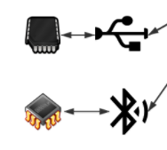

# Webduino-Basic

## 前言

本文初步介绍 Webduino 整体架构设计，给大家有一个基本的认识，包括它是如何快速简易的架设物联网的，注意，本文不适合没有任何编程基础的人尝试，如果没有任何编程基础，可以右转[BPI-BIT-MicroPython](https://github.com/BPI-STEAM/BPI-BIT-MicroPython/wiki)，因此这需要具备天赋技能，会玩会折腾，以及前置语言技能：JavaScript，再加上基本搜索技能，会百度会谷歌会提问会交流，确定你具备了这些技能，就来走入未来的 物联网 与 云服务 结合的 Webduino 世界吧。

## 认识 webduino 基本架构

- 

有关技术关键词

- 协议层 **Firmata**

- 传输层 **Serial**、**Bluetooth**、**WebSocket**、**MQTT**

- 语言层 **JavaScript**、**MicroPython**

- 控制层 **HTML**、**Browser**、**Nodejs**、**Blockly**、**WebCompent**

物联网基础媒介

- 硬件之中的固件程序（Webduino.bin）

- 这是一段通用程序内置在底层芯片中，并将常用的硬件接口抽象映射成 **Firmata** 控制协议。

- 能够通过一个标准的串行协议来实现与计算机应用程序的通信。适用于所有 **Arduino** 板。

- 

- 基于 **WebKit** 的容器（Google Chrome）

- **WebKit** 是一个开源的浏览器引擎，与之相对应的引擎有Gecko（Mozilla Firefox 等使用）和Trident（也称MSHTML，IE 使用），广义上认为是 Google Chrome/Chromium 浏览器的核心渲染引擎，如下图可以在 手机、电脑、笔记本上见到它，也就是基于谷歌内核的浏览器。

- 

### 提供三个物联网典型模型

以下提出三种可以适用所有场合的物联网基础场景。

#### 点对点连接设备

- 

一台物联网设备通过 USB 或 蓝牙 来建立连接，然后再通过 WebKit 的容器控制。

#### 点对多连接设备

- 

多个物联网设备借助一台路由设备（或笔记本），通过 Websocket 来与上层服务建立连接来控制设备，控制的设备可以是路由器自身，也可以是电脑，只要是能运行 WebKit 的容器都可以作为控制器来控制众多设备，形成物联网基本内网。

#### 多对多连接设备

- 

将物联网设备接入网络，然后通过外界的 MQTT 服务器 中转 数据到另一端控制器上，这样就可以完成多对多的网络环境，从而与先前一样，通过 WebKit 的容器来控制设备。

### 名词简答

Q：提到的 WebKit 的容器是指什么？

A：我们可以认为 但凡支持 JavaScript 以及 Websocket 等功能的现代浏览器， 都是我们需要的  WebKit 的容器。

Q：MicroPython 和这个有什么关系？

A：因为 MicroPython 在我看来可以作为底层的动态 Code 修改的固件基础，不需要额外的 OTA 也可以做到需要的升级程序，并且也有足够多的 Python 库作为底层核心的支撑。（最重要的是，我要是做 MicroPython 的底层支持，写起代码比 Arduino C++ 要轻松多了）

## 准备一些所需要的工具吧

### 1. **准备几个基本设备**

    

    例如我在用这个[Bpibit](https://github.com/BPI-STEAM/BPI-BIT)，用这个有技术支持，做起来也会比较方便，也有得玩。

    - [烧写教程](https://github.com/BPI-STEAM/BPI-BIT-WebDuino/wiki#auto-flash%E5%B7%A5%E5%85%B7)
    - [配置教程](https://github.com/BPI-STEAM/BPI-BIT/blob/master/doc/BPI-Bit-Webduino%E8%B6%85%E5%BF%AB%E9%80%9F%E4%B8%8A%E6%89%8B%E6%8C%87%E5%8D%97/BPI-Bit-Webduino%E8%B6%85%E5%BF%AB%E9%80%9F%E4%B8%8A%E6%89%8B%E6%8C%87%E5%8D%97.md)
    - [官方网站](https://tutorials.webduino.io/zh-tw/docs/basic/board/bit-information.html)

    如果不会，可以来看这个视频来体验学习，[BananaPi BPI-BIT学习视频(1)上手](https://www.bilibili.com/video/av28728321)。

    这样你就拥有了物联网的基础设备，为之后控制各种外部硬件做了铺垫，但现在要将它们形成一个网络。

### 2. **准备一个无线路由**

    现在我最推荐的是一台手机，自建一个 2.4 Ghz 的网络，然后等到要部署的时候再换一个真正的路由器。

    由于我比较懒，由于固件默认使用 webduino.io（SSID） / webduino（密码） ，所以我就直接默认的设置了，注意到真正部署的时候，千万不可以这样设置，不安全，容易引起问题，当然自用就无所谓。

    如我下图所示

    

    这样就可以了，如果有必要再去改，没必要就这样就可以了，接下来就开始我们的物联网开发吧。

### 3. **准备一个浏览器**

    基于谷歌的浏览器都可以，比如我用的 QQ浏览器，或者是 360 浏览器，当然我既然要做这个教程的最好的效果， 还是用谷歌浏览器来举例吧，如果你没有，就用我前面提到的几个浏览器，并打开极速模式就好了，一定不能是 IE 浏览器内核的（兼容模式）。

    现在材料已经准备完成，开始正题了,进入 [blockly](https://bit.webduino.io/blockly/) 网站。

    

    可以看到我摆了一堆积木来体验，但实际上，我会在接下来的教程里，分离出来，设计更加直接单一的代码，这将而更适合我们开发。

## [准备工作已经完成，现在点此开始吧](connect.md)。