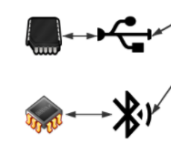

# Webduino 开发基础之设备连接

要先有设备入网，才有物联网，所以本章节就是教你如何连接设备。

## 认识 webduino 下层连接

如前言所说，先有设备入网，才有物联网。

我使用的是 esp32 的 bpibit 版型，它是作为 webduino 的案例工具，因为它过去基于 esp8266 和 arduino 的原型设计出来的，现在它再一次复现到了 esp32 ，所以我们就可以继续沿用一直以来的软件系统，刷写方法和配置方法如下提供。

如果你是直接买了 webduino 产品，则不需要进行刷写，出厂默认的固件，但如果你是使用了其他系统后，想重新用起 webduino 的，需要了解一下如何重置 bpibit （esp32）的固件，相当简单，有一键刷写脚本可以操作。

- [烧写教程](https://github.com/BPI-STEAM/BPI-BIT-WebDuino/wiki#auto-flash%E5%B7%A5%E5%85%B7)

- [配置教程](https://github.com/BPI-STEAM/BPI-BIT/blob/master/doc/BPI-Bit-Webduino%E8%B6%85%E5%BF%AB%E9%80%9F%E4%B8%8A%E6%89%8B%E6%8C%87%E5%8D%97/BPI-Bit-Webduino%E8%B6%85%E5%BF%AB%E9%80%9F%E4%B8%8A%E6%89%8B%E6%8C%87%E5%8D%97.md) 或 [教学文件](https://bit.webduino.io/site/zh_cn/docs/setting.html)

我们需要从这些资料中知道一些连接板子的基本参数，比如如何让板子连上 WIFI ，或是如何得知板子的 ID ，以便得知是否与外网连接等等信息。

## 认识 webduino 上层连接

简单认识一下 Webduino 的连接方式或者说方法。

连接设备只有两种场景，一种是直接在浏览器上直接连接控制硬件，另一种是拿到代码里去连接控制硬件。

前者需要到 [Webduino Blockly](https://bit.webduino.com.cn/blockly/) 网站里进行访问板子的操作。

后者需要到 NodeJS 通过该插件 [webduino-js](https://github.com/webduinoio/webduino-js) 运行代码，直接进行访问板子的操作。

前者用来给用户或自己体验测试，后者将对其进行开发和拓展，考虑到一些深层次的定制化功能，扩充原本并不存在的功能模块。

从软件层面上看，我们可以知道 webduino-js 是在 JavaScript 的基础上提供了 firmata 协议，用以与硬件程序对接控制协议，未来将迁移至解释器中形成动态硬件控制协议。

对于通信连接一块只需要知道两个抽象层，第一个是板子定义，另一个是板子的通信事件触发，具体如何对接业务逻辑（用户直接需求功能），我们且先不谈，先了解一下连接的抽象层接口，有如下 HTML 代码：

```html
<html>

<head>
  <script src="https://raw.githubusercontent.com/webduinoio/webduino-js/master/dist/webduino-all.js"></script>
  <script>
  var board, led;
  // 硬件板子的抽象定义，相当于实例化一个类
  board = new webduino.WebArduino('device_id');
  
  // （点对点）定义一个通过 串口（serial）的设备，
  // 其波特率（baudRate）为 57600，
  // 路径（path）为 COM3（windows）或 /dev/cu.usbmodem1421 （unix）
  // board = new webduino.WebArduino({
  //   'transport': 'serial',
  //   'baudRate': 57600,
  //   'path': 'com3'
  // });

  // （点对点）同上串口
  // board = new webduino.Arduino({
  //   'transport': 'serial',
  //   'path': '/dev/cu.usbmodem1421'
  // });

  // （点对点）定义一个通过蓝牙（bluetooth）连接的设备，
  // 设备地址（address）为 `30:14:09:30:15:67`。
  // board = new webduino.Arduino({
  //   'transport': 'bluetooth',
  //   'address': '30:14:09:30:15:67'
  // });

  // （多对多）定义一个 MQTT 的云端设备，和现场连接不同，
  // 它将被看作一个提供硬件云服务的从机存在网络世界中。
  // 需要一个唯一的 device 号来区分，在硬件固件内部会给出
  // 在必要场景的私有云之下，还需要提供 login 和 password 的认证信息。
  // 但在 webduino 服务器中使用默认就可以了。
  // board = new webduino.Arduino({
  //   'transport': 'mqtt',
  //   'device': '',
  //   'server': 'wss://ws.webduino.io:443/',
  //   'login': 'admin',
  //   'password': 'password'
  // });

  // （点对多）与 MQTT 不同的是，它将板子当作服务器。
  // 由本地主动去控制它们，所以它可以存在底层内网当中。
  // 使用的通信协议为 websocket，使用该通信当时需要浏览器内核特别支持。
  // 优势就是保持与板子的连接，而不是网络执行一次就退出。
  // url 指板子的路径，'wa1501.local:8080' 是 mdns 服务的结果。
  // 但实际上都是转换成 IPv4 地址后进行连接的。
  // 例如：`192.168.1.5:8080'，其中 8080 指端口号，因为 80 被用作网页服务了，所以这点需要额外注意。
  // board = new webduino.Arduino({
  //   'transport': 'websocket',
  //   'url': 'wa1501.local'
  // });

  // 当板子连接成功后，会将该事件触发，所以只需要在这里做对应的事件就可以了。
  board.on(webduino.BoardEvent.READY, function() {
    console.log('board ready', err.message);
  });

  // 当板子返回错误时，会将该事件触发，所以只需要在这里做对应的事件就可以了。
  board.on(webduino.BoardEvent.ERROR, function(err) {
    console.log('board error', err.message);
  });

  // 当板子将要断开之前，会将该事件触发，所以只需要在这里做对应的事件就可以了。
  board.on(webduino.BoardEvent.BEFOREDISCONNECT, function() {
    console.log('board beforedisconnect');
  });

  // 当板子断开连接后，会将该事件触发，所以只需要在这里做对应的事件就可以了。
  board.on(webduino.BoardEvent.DISCONNECT, function() {
    console.log('board disconnect');
    // test: should not emit 'disconnect' again
    board.disconnect();
  });
  </script>
</head>

<body>
  <div>webduino-test</div>
</body>

</html>

```

虽然看注释可以得知它们的主要作用，但我还是要拿出来单独讲解的，我们将从上层将到下层的顺序进行讲解。

板子连接后的异步事件类型主要分为以下四个，当然也不止如此，总之先有一个大体的概念就好了。

```javascript

// 当板子连接成功后，会将该事件触发，所以只需要在这里做对应的事件就可以了。
board.on(webduino.BoardEvent.READY, function() {
    console.log('board ready', err.message);
});

// 当板子返回错误时，会将该事件触发，所以只需要在这里做对应的事件就可以了。
board.on(webduino.BoardEvent.ERROR, function(err) {
    console.log('board error', err.message);
});

// 当板子将要断开之前，会将该事件触发，所以只需要在这里做对应的事件就可以了。
board.on(webduino.BoardEvent.BEFOREDISCONNECT, function() {
    console.log('board beforedisconnect');
});

// 当板子断开连接后，会将该事件触发，所以只需要在这里做对应的事件就可以了。
board.on(webduino.BoardEvent.DISCONNECT, function() {
    console.log('board disconnect');
    // test: should not emit 'disconnect' again
    board.disconnect();
});
```

有了这些基础，我们就完成了板子的 JavaScript 连接过程，至此我们已经清楚得知了 webduino-js 是如何在软件上连接硬件，但我们还需要通过具体的实例来验证，以下各种典型通信架构方式。

### 点对点连接设备



基于最初提出的框架典型可知，有如下两种连接典型，一是有线的串口连接，二是无线的蓝牙连接。

该类方法为了与电脑的硬件连接通信，需要额外的系统接口权限才能做到，比如安装谷歌浏览器拓展，或者是 NodeJS 拓展。

虽然它并不好用，也比较过时了，对于物联网来说，点对点只存在于硬件设备的原始调试阶段，但我们仍然会提及这个概念。

#### 一、有线串口连接

现在已经无法在浏览器端进行串口或蓝牙的连接了，因为它被浏览器认为不安全而限制了，浏览器访问硬件需要通过本地系统提供的模块才能操作，所以目前屏蔽了，因为通用性太差，想要在各平台复现的难度偏大。

但在 NodeJS 代码中依然是可以的，比如说如下代码就是连接串口的硬件配置。

```javascript
// Need to acquire 'webduino' in Node.js:
// var webduino = require('webduino-js');

var board, led;

board = new webduino.Arduino({
  transport: 'serial',
  path: '/dev/cu.usbmodem1421'
});

// or:
// board = new webduino.Arduino({
//   transport: require('webduino-serial-transport'),
//   path: '/dev/cu.usbmodem1421'
// });

board.on('ready', function() {
  led = new webduino.module.Led(board, board.getDigitalPin(10));
  led.on();
});

```

需要额外 NPM 安装该模块[webduino-serial-transport](https://github.com/webduinoio/webduino-serial-transport)，然后使用即可。

#### 二、无线蓝牙连接

同样的道理，需要额外 NPM 安装该模块[webduino-bluetooth-transport](https://github.com/webduinoio/webduino-serial-transport)，但使用的代码略微有一点不同。

```javascript
// need to acquire 'webduino' in Node.js:
// var webduino = require('webduino-js');

var board, led;

board = new webduino.Arduino({
  transport: 'bluetooth',
  address: 'xx:xx:xx:xx:xx:xx'
});

// Or:
// board = new webduino.Arduino({
//   transport: require('webduino-bluetooth-transport'),
//   address: 'xx:xx:xx:xx:xx:xx'
// });

board.on('ready', function() {
  led = new webduino.module.Led(board, board.getDigitalPin(10));
  led.on();
});
```

所以就提出这两种典型，由于这两种典型不适合形成大面积的物联网基础设备网络，所以我们进一步提出以下两种典型模型（一对多和多对多），另外蓝牙本应该是属于点对多的模型之下的，但由于蓝牙推出 5.0 后（4.0 以上）才有组网，所以早期的设计里面没有将其看作一个物联网设备，为了不找麻烦，这里就认为蓝牙是一对一连接吧，但技术是会进步的，并非一成不变的，哪怕是串口也有一对多（RS485），只是在这里，没有将其考虑进来，因为接下来才是重头戏。

### 点对多

并不是说 串口 和 蓝牙就没有一对多的网络架构，只是它们目前还不是以太网的组成结构，也就是说，它们还没办法像 WIFI 这类以太网控制器那样拥有 IP 地址，允许连入互联网，所以我们的点对多的模型选取的是局域网（LAN）下的同时连接多点设备。

这样的模型存在一个缺陷，它必须有一个上层路由进行数据交换才能完成连接，形成本地局域网，所以与前者点对点不同的地方在于多了一个路由，这样控制的程序也在同一个网络下，从而控制不同的设备，为了实现这个功能，虽然有很多种方法，或者说应用层协议，比如 TCP、UDP、HTTP、WebSokect等，但我们还是挑选了 WebSocket 通信协议，因为它在浏览器内核内置了，而且是 HTTP 与 TCP 的结合，允许跨域访问和保活连接，这样控制过程将会更加实时和稳定，解决了过去，服务器不能控制网页前端的麻烦，如今透过这种方式，避开了 Ajax 的被动轮询刷新页面，同样也带来了服务器主动推送消息功能，使得网页更像一个本地的 APP 应用，所以也间接导致了现在许多人更愿意开发一个网页通用所有平台。

说了这么多，就来看看代码吧，其实也很简单，主要都是一些板子定义的参数变化而已。

这之前先得知一下板子的 IP 地址，搜索附近的热点可以知道，板子会发出一个热点，它会显示自己的名称（开机滚动的四个白色字符）加上自己此时的 IP 地址，需要注意它是否与浏览器所处同一个网络之下，否则将无法访问到它，这样就可以得知板子的 IP 地址后进行连接了。

```javascript
  board = new webduino.Arduino({
    'transport': 'websocket',
    'url': '192.168.43.155:8080'
  });
```

它将板子当作服务器来连接，由本地主动去控制它们，所以它可以存在底层内网当中，由于使用的通信协议为 websocket，使用该通信当时需要浏览器内核特别支持，优势就是保持与板子的连接，而不是网络执行一次就退出。

其中 url 指板子的路径，例如：`192.168.1.5:8080'，其中 8080 指端口号，因为 80 被用作网页服务了，所以这点需要额外注意。

为什么说是点对多呢？

先通过浏览器的在线编辑器感受一下，如下图。


再来，我们通过 NodeJS 代码来看如下示例代码就可以体会到了。

```javascript
  board1 = new webduino.Arduino({
    'transport': 'websocket',
    'url': '192.168.43.155:8080'
  });
  board1.on('ready', function() {
    led = new webduino.module.Led(board, board.getDigitalPin(10));
    led.on();
  });  
  
  board2 = new webduino.Arduino({
    'transport': 'websocket',
    'url': '192.168.43.156:8080'
  });
  board2.on('ready', function() {
    led = new webduino.module.Led(board, board.getDigitalPin(10));
    led.on();
  });
```

同样道理，你也可以封装一次，比如这样写：

```javascript
  function new_board(board_ip, call_back) {
    board = new webduino.Arduino({
      'transport': 'websocket',
      'url': 'board_ip'
    });
    board.on('ready', call_back);  
  }

  board1 = new_board('192.168.43.155:8080', function() {
      led = new webduino.module.Led(board, board.getDigitalPin(10));
    led.on();
  });

  board2 = new_board('192.168.43.156:8080', function() {
      led = new webduino.module.Led(board, board.getDigitalPin(10));
    led.on();
  });

```

这便是完成了一对多的连接模型，借助路由器，我们可以将其连入网络，由浏览器上网获取数据服务，然后下传控制大量硬件，这便是物联网的基础，接下来就是更为复杂的一层，多对多的概念。

### 多对多

和点对多的时候一样，我们先用浏览器体会一下，但需要注意的是需要网络才能把在线编辑器带回到本地来，记得我们在配置设备的时候，会发现有一个 DeviceID 的参数，表示你板子的 ID ，其中连接就是使用这个方法，这在配置设备联网的时候就会告诉你了，不清楚的可以到这里查看[配置教程](https://github.com/BPI-STEAM/BPI-BIT/blob/master/doc/BPI-Bit-Webduino%E8%B6%85%E5%BF%AB%E9%80%9F%E4%B8%8A%E6%89%8B%E6%8C%87%E5%8D%97/BPI-Bit-Webduino%E8%B6%85%E5%BF%AB%E9%80%9F%E4%B8%8A%E6%89%8B%E6%8C%87%E5%8D%97.md)。

做一个浏览器的示例，如下图：


此时板子会自动连入远端的服务器，所以我们在其他地方也可以通过浏览器进行连接和控制，而并不需要与板子同处一个网络，即完成了所谓的多对多了，因为基于此，我们同样给其他人复现这个场景，而点对多的时候，只能自己内部网络测试，无法分享给其他人。

在 NodeJS 下代码也很简单，其实和浏览器是一样的道理，连接设备就是这样简单和容易，但带有延迟（因为受到服务器连接延迟影响）。

我们不难发现，多对多存在一些问题，例如通过 MQTT 服务器中转数据，或者说，特殊场景制约，在外部网络不够理想的时候，比如网络比较差的时候，我们还是会需要用回点对多的场景，然后统一交给浏览器上网，局域网下的设备，将不会连入外网，此时可以缓解外部网络速度拥堵的情况。

但各有各的优点，根据适合的场景来选取适合自己的网络模型吧，至此已经讲完了 webduion-js 的物联网基础模型。

接下来就进入正式的开发部分吧。

