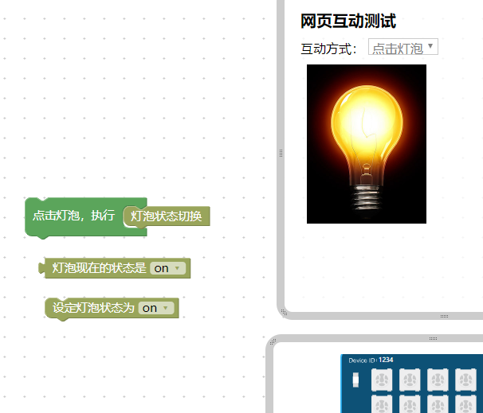
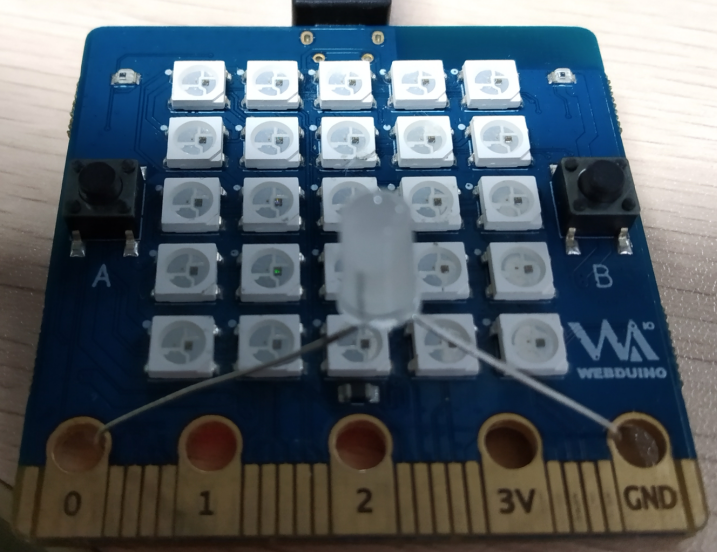
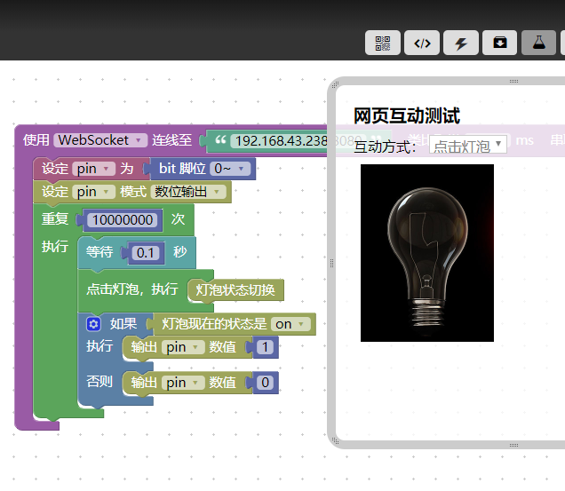
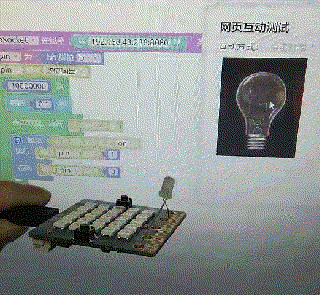
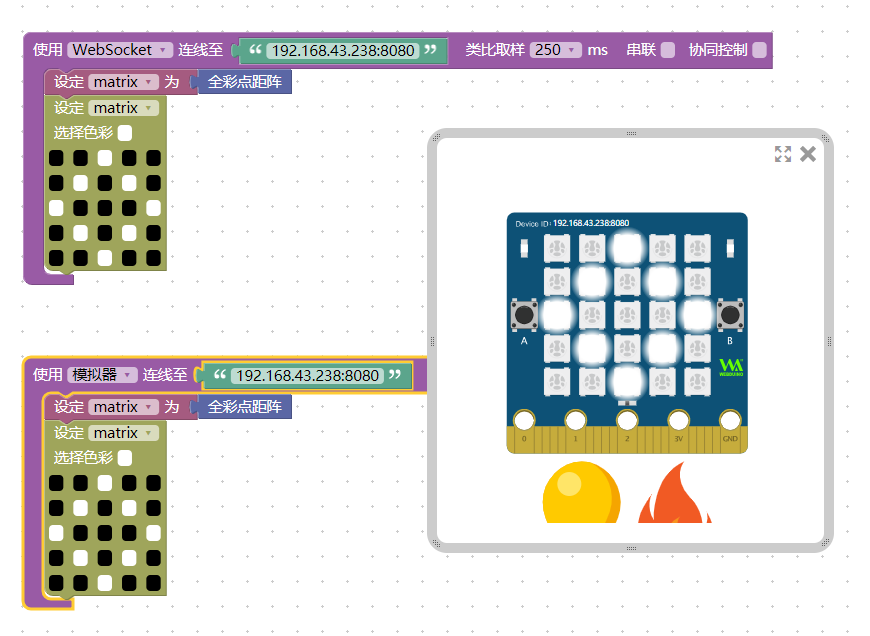
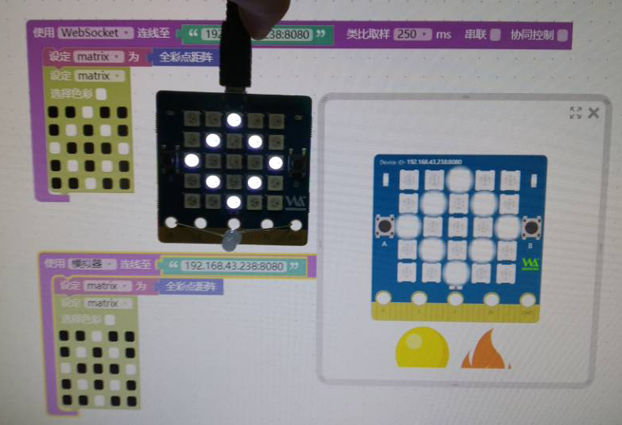
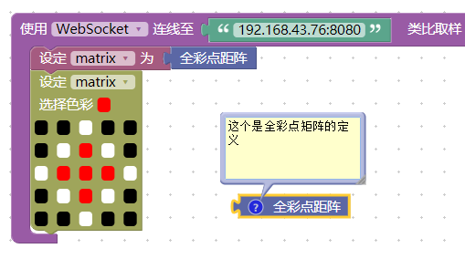
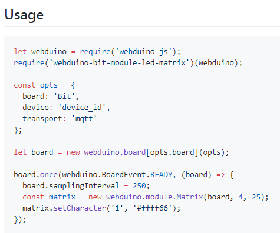

# Webduino 开发基础之设备控制

说到物联网，目前而言的大部分技术基本都没有为硬件控制做预留，我们何曾想过要在 JavaScript 中控制一盏灯呢？直接给引脚电平信号的方式直接控制它，这样的做法在我们原来的网页开发中怎么可能会有这个预留，所以 webduino 将硬件看作一个云服务基础，对它的 API 访问，即可控制它，而这个转换也更符合 JavaScript 的开发思维，所有的东西都是通过 API 的接口方式给出，而不是自己全部实现，把不擅长的部分交给其他人操作。

那么，我们可以这样理解，Webduino 下的固件程序，可以让硬件当作硬件云服务提供给软件，所以我们在上层的时候，只需要关心这个 API 服务是否存活或是在线即可，它本身如何工作取决于它提供的 API 接口，我们只需要对它提供操作就可以了。

基于这个概念，我们只需要专心在上层写好对应的硬件控制程序就可以了，这要如何写呢？

我们接下来将会讲解两个基础，这两个基础是为了说明到下一阶段 NodeJS 开发 的铺垫，分别是 [webduino-js](https://github.com/webduinoio/webduino-js) 和 [webduino-blockly](https://github.com/webduinoio/webduino-blockly)，前者是开发者所用，后者是用户体验所用，一个是后端，另一个则是前端，后端指直接的代码，前端则是通过一些积木生产的模块，形成对应的后端代码并执行，这样做的好处就是，前端定义的积木功能可以先行，后端回头再接入即可，所以模拟器也因此而生，当然要将这一系列的过程全面通用模块化还有些难度，目前来讲，能基于 esp 系列的芯片做好一类应用的抽象就不错了。

## 点亮一盏灯

点亮一盏灯，作为硬件的最起码的控制，任何硬件的接入都是从一盏灯开始的，因为它非常的简单，但也非常的直观，那么有几种方法可以亮灯呢？

### 在软件上的亮灯（变换图片）

我们使用这个教程中提到的方法[网页互动 文字、點擊、圖片](https://tutorials.webduino.io/zh-tw/docs/blockly/web/basic-1.html)

做法就比较简单了，就只是纯粹的软件上的变化，效果如下图。



### 软件与硬件结合来控制亮灯

这里我使用的是本地的局域网控制，不需要连接外网服务器，控制更加可靠，基于前者我们可以写出搭建出对应的积木过程，但我最后将会通过直接的代码控制来实现。

来，LED 准备好，一盏灯还是可以找出来的。



搭一个基本的积木例子。



可以看到，它就是在控制 Pin 0 这个脚的变化，当然，也许你现在不懂是为什么，但你只要看到 Pin 0 输出为 1 的时候，灯会亮就是了，再来就是分清正负极，同样的事情，我也在 MicroPython 中提及过了，可以先转回去看解释再回来继续，点此查看[如何控制引脚IO](https://github.com/BPI-STEAM/BPI-BIT-MicroPython/wiki/how_to_io)，当然，你如果能理解，就继续往下看吧。

运行效果如下：



### 不使用积木的方式运行程序

在积木中， 我们只能靠畏畏缩缩的方式去编程，实在是不爽，我们也直接用代码来编程即可快速实现灯的闪烁（blink），也就是所谓的闪烁，并且我会附上一个与积木实现的对比来感受一下，当然积木是在代码的基础上实现的，掌握了积木的用法以后，我们就会回到代码的方式去实现它。

使用的代码如下：

```javascript
'use strict';

var webduino = require('webduino-js'),
  board,
  led;

board = new webduino.Arduino({
  'transport': 'websocket',
  'url': '192.168.43.238:8080'
});

board.on(webduino.BoardEvent.READY, function () {
  led = new webduino.module.Led(board, board.getDigitalPin(25));
  led.blink(1000);
});

```

你会发现它将会自动的闪烁现在接上的 LED 灯，和先前代码有一些不一样的地方在于定义硬件引脚编号，这个编号是源自于 ESP32 的硬件内部定义的，也就是和 bpibit 无关，而我是根据它的原理图等一些硬件资料查阅的得到的，在真正面对物联网的时候，难免会接触到一些硬件的引脚定义，不要觉得很复杂很困难，用的时候查一下就好了，不需要去记忆。

## 获取硬件 API 接口

举例来说，在浏览器里所使用的这个功能，要如何在代码中使用呢？



实测效果如下：



对于我所使用的 bpibit 版型，在 [github-webduinoio](https://github.com/webduinoio) 官方账号上，可以看到一些专门的定制模块在里面，这些是官方提供的一些扩展功能模块，尤其是这个版型特有的硬件功能模块，需要额外下载代码进去才能使用。



以 [webduino-bit-module-led-matrix](https://github.com/webduinoio/webduino-bit-module-led-matrix) 为例，进去后看教程，通过 npm 来下载代码并使用，这样就可以在浏览器的 Blockly 之外应用这个 全彩点矩阵 模块了，示例代码，大概长成下面这样，但我们现在，只需要知道它是这样的就可以了，因为我们在接下来的实战开发会教你如何去调用它，也许你通过了前面的调用灯的方法也猜到了这个模块代码应该怎么用了呢？相信我，它并不难，试试就知道了。



## 自制硬件 API 接口

目前在基础章节还暂时不考虑添加更多硬件 API 功能，在你还没了解的更深入的硬件控制协议的时候，自制硬件功能，暂时还属于比较高阶的做法，它需要你对上下程序接口都较为熟悉才行，在底层提供 API 功能后，并在云端后台的 JS 模块中写对于的控制协议才行。

## 写在最后的话

至此，我们关于 Webduino 的软件基础开发已经讲完，往后我会继续跟进硬件的兼容开发，相信会是底层 Python 顶层 JavaScript 的方式交互彼此功能，使得我们云端上层也可以更加轻松的更改底层，生成我们所需要的硬件数据，一旦结合了用户的需求得到的软件功能成型了，那就是用户真实痛点了，因此也不会轻易的去修改它，而为了可以扩大它的应用范围，我们只需要对硬件进行抽象接口设计，只要硬件的提供的云端 API 服务一致，软件功能自然不需要变动就，也就可以形成了你专有的 Webduino 物联网服务。

现在，假设你已经有了一定的 JavaScript 基础
，也有了一点控制物联网的设备的基础概念了，那不妨试试进入实战教程吧，点此进入[Webduino-NodeJS 开发与云服务的结合的地区空气质量定时查询](https://github.com/junhuanchen/webduino-nodejs)

如果你想看到别人的作品，你也可以登陆 bilibili 站或 Facebook 等地方搜索 Webduino 来学习别人的作品。
