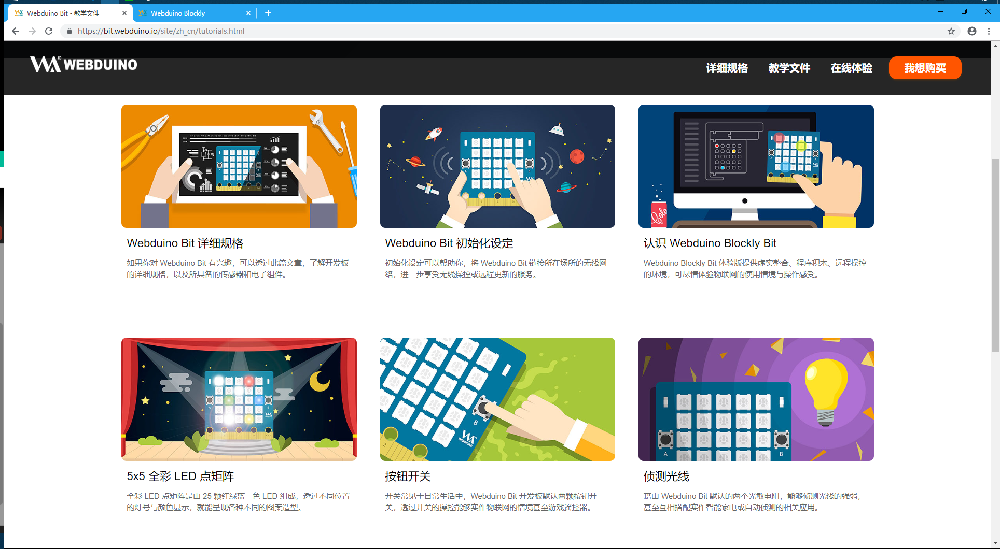
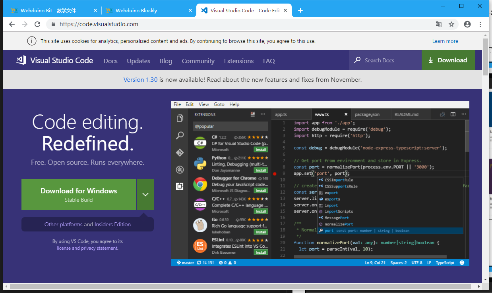
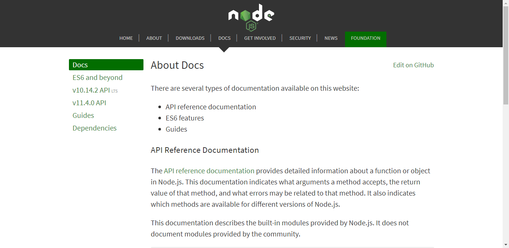
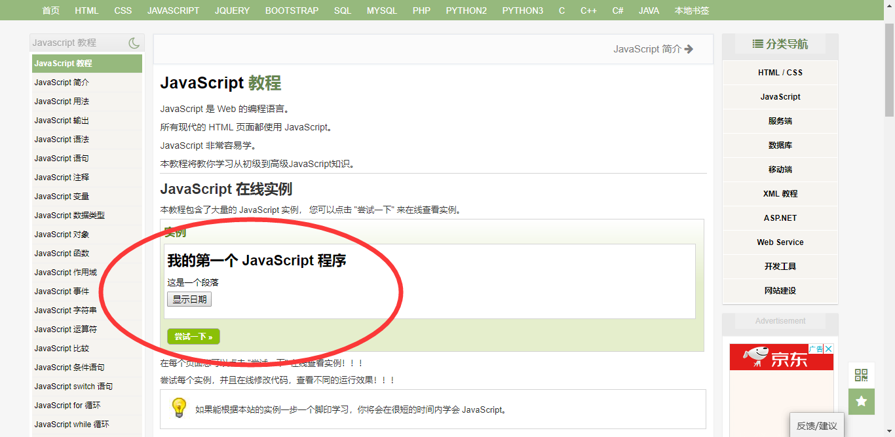
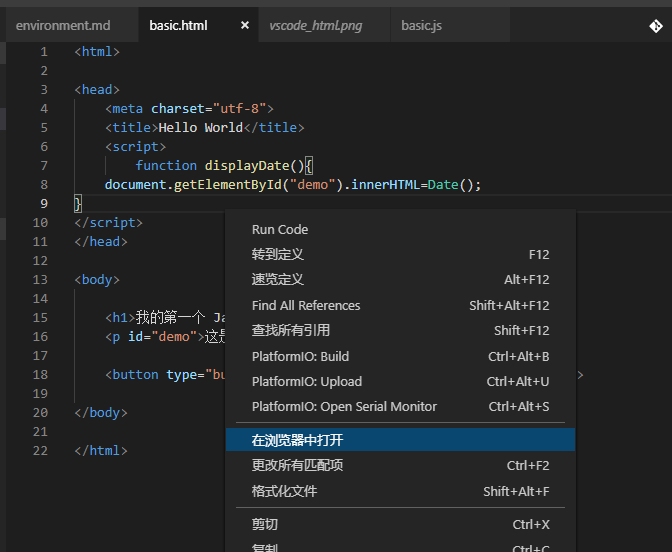
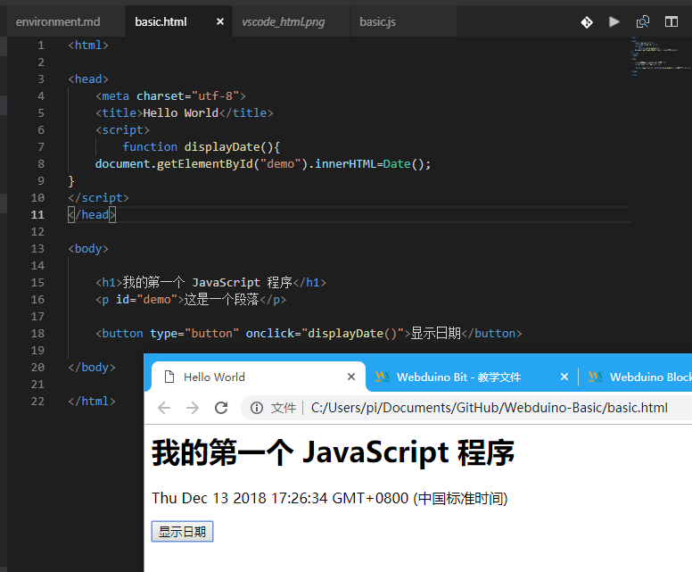
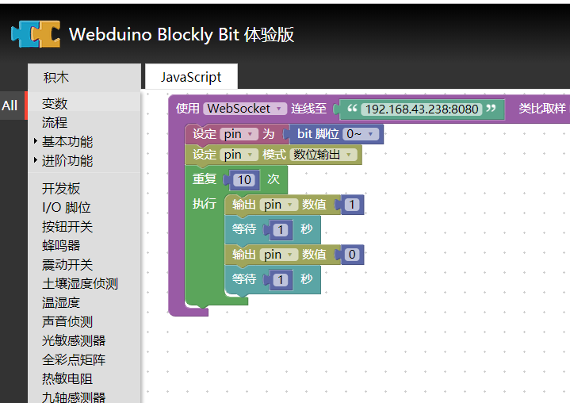
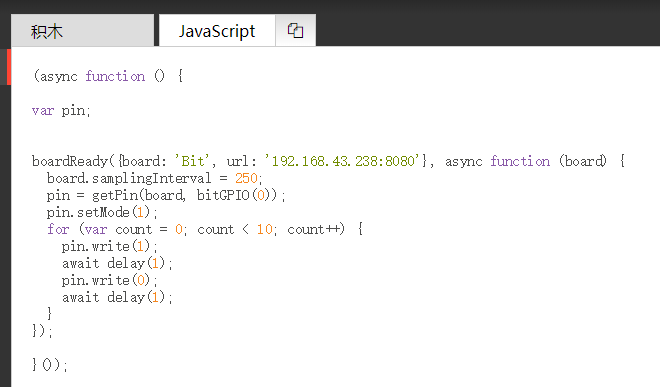
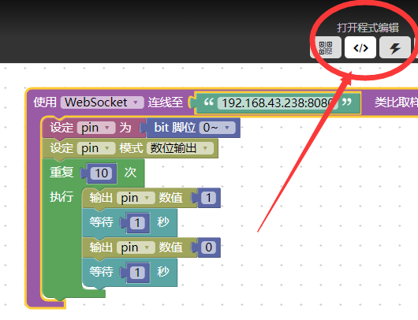
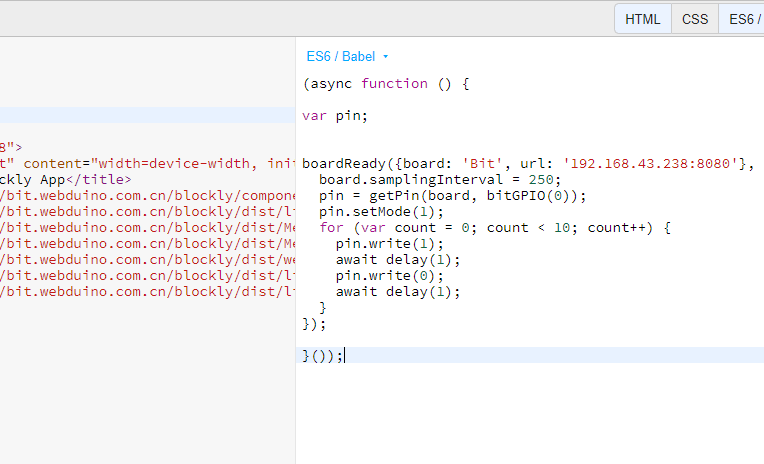

# Webduino 开发基础之环境准备

因为 JavaScript 生于互联网，而物联网作为下一代互联网，那我们还有什么理由拒绝它呢？

## 选一个喜欢的编程环境吧

在开始物联网开发之前，得先有个基本的编程环境，而开发它们只需要有 JavaScript 相关的工具就可以了。

### 选择 Chrome 作为开发工具

打开浏览器，进入 [Webduino 教学](https://bit.webduino.io/site/zh_cn/tutorials.html) 和 [Webduino Blockly](https://bit.webduino.com.cn/blockly/) ，就完成了最起码的环境搭建，具体如何使用编程环境，我们将留在下一章讲解，本章只讲解网络的 JavaScript 开发基础。

### 选择 VSCODE 作为开发工具

打开浏览器，下载 [VSCODE](https://code.visualstudio.com/) 跨平台前端编辑器，然后可以安装几个和 JavaScript 有关系的插件，例如：Debugger for Chrome 、 Code Runner 之类的,当然不必现在装，要用时再装，因为 VSCODE 没有什么优点，就是功能插件多，并且它是一个免费的跨平台前端利器，个人相当推荐。

### 选择 NodeJS 作为开发工具

打开浏览器，进入 [NodeJS](https://nodejs.org/en/) 选个喜欢版本安装吧，我安装的时候用的是 8.94 现在已经到 10 的版本了，所以这个新事物不仅发展很快，而且也受到全世界的人关注，跟随主流一起添砖加瓦贡献你的力量吧，从此出任 CTO ，迎娶白富美，走上人生巅峰。

值得一提的是，当你为电脑安装了 NodeJS 后，VSCode 会自动识别该电脑安装的 NodeJS，从而自动匹配 NodeJS 环境。（查找环境变量）

## 开始运用工具编程吧

最初的时候，我们的编程还不需要在硬件上进行操作，因为我们有云端仿真进行尝试，最开始的是先学会一点基础的 JavaScript 操作，包括如何运行 JavaScript 代码，如何调试它，直到熟悉它的基础编程后，我们再开始进行物联网开发。

### 运行一段 JavaScript 代码

我们可以学习各种在线运行的实例，因为云端开发只需要有一个浏览器就可以了。

我个人推荐先从 浏览器（Browser） 开始编程，再转换到 nodejs 的后端编程开发。

一个可以在线运行的 [JavaScript](http://www.runoob.com/js/js-tutorial.html) 教程。

一个可以在线运行的 [NodeJS](http://www.runoob.com/nodejs/nodejs-tutorial.html) 教程。

而当你在网页上学会了运行 JavaScript 以后，我们就可以开始在 VSCODE 中尝试复现了。

### 在 VSCODE 上做 JavaScript 开发

从本节开始，你需要确保你已经知道什么是 JavaScript 和 NodeJS 了，否则你将无法理解我在做什么。

我们知道，虽然可以在网页端上的在线开发，但能做的始终是有限的，想要在别人的网页上扩充和调用往往很麻烦。虽然也并不是不可以，但比起基于别人的，为什么不把代码拷贝下来，自己再基于此继续设计呢？反正常用的 JavaScript 代码都是公开可复用的，在 Web 的世界中，没有什么是学不来的，如果有，那一定是在 Web 世界之外的事物了。

那么现在就准备一个基本的 [basic.html](https://github.com/junhuanchen/webduino-basic/blob/master/basic.html) 吧，比如我们在教程中运行过的第一个实例，要如何在 VSCode 中复现呢？

这里有一篇比较简单的教程可以参考，如何用 [VSCode 运行 HTML 文件](https://www.jianshu.com/p/4030be25c98e)。

我个人常用的做法是先安装插件 `Open HTML in Default Browser`（没办法，VSCODE 就是在用插件） ，后用 VSCode 打开 basic.html 文件，此时在文件中空白地方点击右键，即可见到 `在浏览器中打开` 选项，点击它，会让你选择要打开的浏览器。

这样就完成了 HTML 的运行。

其实写一段 HTML 并不难，对吧。

当你学会了如何使用 VSCode 运行 HTML 文件，那不妨试试[如何用 VSCODE 直接运行 JavaScript 代码吧](https://jingyan.baidu.com/article/39810a23416c3fb636fda6da.html)。

### 在浏览器上做 webduino 开发

在没有开始编写代码之前，我们先通过浏览器的方式来了解一下 Webduino 物联网开发，那么什么是 [webduino-blockly](https://github.com/webduinoio/webduino-blockly) 呢？

如下图，可以看到它其实就是一个在线的积木编辑器，可以给不懂程序的朋友演示程序用，或者自己简单测试用。

如果我们点击 JavaScript 的话，就可以看到对应的 JavaScript 代码。

但这里只能看到代码，并不能编辑，所以我们还可以使用右上角的功能按键，进入一个在线的 Js 编辑器，进行编辑，它会把你当前的代码转移到那边去，如下图操作所示。

此时你就会看到一个在线的编辑器了，基于 [JSBin](jsbin.com) 的功能。

上述图片仅供了解一个基本工具，具体怎么操作你还需要到其中去尝试，包括[如何使用在线编辑器](https://tutorials.webduino.io/zh-tw/docs/blockly/index.html)。

### 在 VSCODE 上做 webduino 开发

既然我们可以在浏览器里运行 Webduino 的程序，那么同样的，我们也可以在越过积木，直接在代码中运行程序，从而更加方便的拓展出积木所没有的功能。

它依赖于这个 Js 库 [webduino-js](https://github.com/webduinoio/webduino-js) ，
具体使用方法我会在下节中演示说明代码，请先学会如何在 VSCODE 中运行代码和使用 Npm 安装依赖库吧。

## [用各种方式连接板子架设物联网吧](https://github.com/junhuanchen/webduino-basic/blob/master/connect.md)
